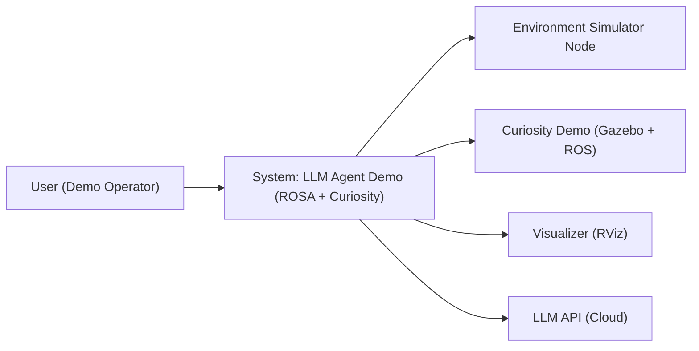
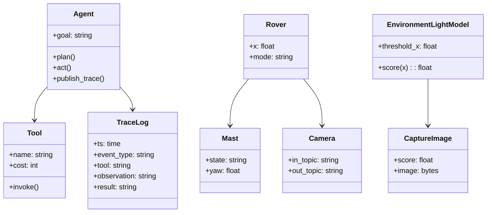

# requirements.md (v0.1.3) — Space ROS Curiosity Demo × ROSA (LLM Agent)

> design v0.6（Adapter公開I/F、prompts.yamlスキーマ、CaptureAndScore I/F確定）へ追従

## 1. 概要（目的・背景・対象範囲）

### 1.1 目的
本システムは、Space ROS に付属する Curiosity ローバーデモ上で、LLM エージェント（nasa-jpl/rosa 由来の枠組み）を用いて「フレーム問題の例題」を解くデモを実現することを目的とする。  
エージェントには明示的な手順を与えず、環境フィードバック（暗所）とシステム制約（排他制御）から、必要な行動系列（例：旋回で観測改善→必要なら移動→再観測）を自律的に組み立ててタスク完遂できることを示す。

### 1.2 キーメッセージ
「無限の『状況×行動』の組み合わせから、LLM が『因果』だけを抽出する。」

### 1.3 対象ユーザ
- デモ実施者（開発者・研究者）：WSL2 + Docker で起動し、Gazebo/RViz で挙動を観察する。
- 観覧者（レビューア）：画質が閾値を超えた静止画像の取得と、そこに至る Reasoning（推論ログ）を観測する。

### 1.4 対象範囲（スコープ）
対象範囲は「LLM エージェントが行動を組み立て、所定品質の画像を取得し、推論過程を可視化する」ことに限定する。  
以下は意図的に対象外とする（規模膨張を避けるため）。
- 障害物回避の導入、高度な自己位置推定、複数センサ統合、地図生成、経路計画の高精度化
- 実運用レベルのセキュリティ、可用性、監査

### 1.5 成功条件（デモ合格条件）

#### 必須（実装で担保し、DoDで検証する）
以下が「観測可能な出力」として確認できれば合格とする。
1) 画質スコアが閾値以上の静止画像を取得できること（画質は明るさスコアのみで判定）。  
2) そこに至る Reasoning 過程（観測→仮説→行動選択→結果→次の仮説…）が、構造化されたログとして提示され、RViz（またはコンソール）上で追跡できること。  
3) 排他制御（マスト展開中は移動不可）が実装されていること。発生した場合、移動は失敗し、理由文字列として「Need to close mast」を返し、エージェントは継続実行可能であること（本イベントの発生自体は合格要件ではない）。

#### 期待（LLM挙動に依存。再現性は保証しない）
暗所（低スコア）を観測した際に、次のような推論遷移がログ上で観測できることが望ましい。  
- 「まず旋回して別方向を再撮影し、改善しない場合に移動を検討する」  
本プロトタイプでは、順序を強制するハードガードは導入せず、ソフト誘導（プロンプト／ツール説明／コスト提示／ログ整形）により発生確率を上げる。

---

## 2. 概念設計

### 2.1 コンテキスト図（C4 L1）

### 2.2 ドメインモデル（概念）
- Rover: ローバ本体。移動状態・位置（少なくとも X 方向の進行）を持つ。
- Mast: マスト。展開/収納状態、および旋回角を持つ。
- Camera: カメラ。raw画像入力を持ち、静止画として加工・送出される。
- EnvironmentLightModel: X 座標から明るさスコアを算出する（閾値等は設定ファイルで可変）。
- CaptureImage: 静止画像（暗さ加工済み）と、スコア（ログ／焼き込み）情報を含む。
- Agent: 目標を受け、Tools を呼び出して状態遷移を生む。
- Tool: エージェントに提供する操作（撮影、移動、マスト操作、停止、状態取得）。
- TraceLog: エージェントの推論ログ（観測・仮説・選択・結果・エラー等の時系列）。
- ToolCost: ツールの概算コスト（ソフト誘導用途）。ツール説明とログに表示する。

### 2.3 主要ユースケース
- UC-1: 地面テクスチャ調査（固定プロンプト）
  - 入力: 「地面のテクスチャを調査して」
  - 出力: 品質閾値を超える静止画像 + 推論ログ（構造化） + 簡易要約（ログ末尾に要約として出力）
- UC-2: 状態問い合わせ（追加デモ）
  - 入力: 「現在のローバーの状態を教えて」
  - 出力: マスト状態、移動可否、現在 X 推定（取得できる範囲）、直近スコア、直近エラー等

### 2.4 高位アーキテクチャ（レイヤ／コンポーネント）
- Presentation/Observation:
  - RViz 可視化（正解ゾーン、現在位置、推論ログのテキスト表示）
- Agent Orchestration:
  - ROSA ベースのエージェントノード（プランニング・メモリ・ガードを含む）
  - ソフト誘導（プロンプト／ツール説明／コスト提示／ログ整形）
- Integration/Adapters:
  - Curiosity デモ既存コマンドの ROS ラッパ（Service/Action 混在）
- Simulation Augmentation:
  - 明るさシミュレータ（X→スコア、画像暗化、スコア焼き込み、再パブリッシュ）
- Config:
  - 閾値、トピック名、ツールコスト、ログ出力などの外部設定（YAML）

---

## 3. 要件一覧（機能＋非機能）

### 3.1 機能要件（FR）

FR-001: 固定プロンプト「地面のテクスチャを調査して」を入力として受け付け、エージェント行動を開始できること。  
FR-002: 画像入力 `/image_raw/compressed` を受け、暗さ加工＋スコア焼き込み（またはログへの確実な記録）を行い、静止画像として `/capture/image_raw/compressed` に再パブリッシュできること。  
FR-003: 明るさスコアは TF 上の X 座標に基づき算出し、明るい領域（X範囲）や合格閾値は設定ファイルで変更可能であること。  
FR-004: 画質判定は明るさスコアのみを用い、閾値以上で「成功」と判定できること。  

FR-005: エージェントに提供するツールとして、少なくとも以下を実装すること。
- 撮影＋品質判定（CaptureAndScore: スコア・合否・画像トピックを返す）
- マスト操作（`/mast_open`・`/mast_close`・`/mast_rotate` のラップ）
- 移動操作（`/move_forward`・`/turn_left`・`/turn_right`・`/move_stop` のラップ）
- 状態取得（マスト状態、移動可否、直近スコア、直近エラー等）
- 撮影＋品質判定（CaptureAndScore: スコア・合否・画像トピックに加え、観測不能時は ok=false と error_reason を返す）

FR-006: 排他制御によりマスト展開中に移動要求が来た場合、移動は失敗し、理由文字列として「Need to close mast」を返すこと。  
FR-007: エージェントはツール呼び出しのオーケストレーションに加えて、サブゴール生成（プランニング）、履歴保持（メモリ）、安全ガード（行動制約）を含む構成とすること。  
FR-008: 推論ログ（観測・仮説・選択・結果・エラー）を時系列で出力し、RViz 上で閲覧可能であること。ログは少なくとも「イベント種別」「ツール名」「観測したスコア」「結果（成功/失敗と理由）」を含むこと。  
FR-009: 「現在のローバーの状態を教えて」に対し、状態取得ツールを用いた回答が可能であること（追加デモ）。  
FR-010: 最終的に、品質閾値を超える静止画像取得と、そこに至る推論ログが提示できること。加えて、暗所時の“旋回を先に試す”挙動は期待されるが、成功判定の必須条件とはしない。  

### 3.2 非機能要件（NFR）
NFR-001: 研究用プロトタイプとして、可用性・セキュリティは最低限とする（ただし API キーをリポジトリに記録しない）。  
NFR-002: 実行環境は Windows 上 WSL2 (Ubuntu) + Space ROS 公式デモ用 Docker を前提とし、README に最低限の起動手順を記載すること。  
NFR-003: 設定（閾値、トピック名、ツールコスト、デモ方針、ログ設定等）は設定ファイルに外出しし、コード変更なしで調整できること。  
NFR-004: 実装はシンプルさとデバッグ容易性を優先し、巨大化しやすい機能（地図生成等）を導入しない。  
NFR-005: LLM API 利用部分は環境変数または .env を用いて注入し、.gitignore で秘匿する。  
NFR-006: デモの意図（暗所ではまず低コストな観測改善＝旋回・再撮影を優先し、改善しなければ移動を検討する）を、以下の“ソフト誘導”で支援する。ただし、行動順序を強制するハードガードは導入しない。
- システムプロンプトおよびツール説明に、移動がコスト高であること、まずその場で観測改善を試す推奨を明記する。
- ツールメタデータとして概算コスト（例：rotate < move）を提示し、ログにも記録する。
- 期待挙動が観測できるよう、推論ログの粒度・フォーマットを整える（観測→仮説→選択→結果）。

<仮定>
- Space ROS / Curiosity デモの ROS2 相当バージョンは環境により変動し得るため、Python 実装側は極力 ROS2 標準（rclpy）範囲で作る。
- RViz 表示は標準 Marker（TEXT_VIEW_FACING 等）を用いて実現し、追加プラグインは必須にしない。
- 画像の暗さ加工は「静止画として地上へ送られる」というニュアンスを持たせるため、リアルタイム映像の入力とは別トピックへ出力する。
</仮定>

---

## 4. 実装方針（技術スタック・ディレクトリ構造案）

### 4.1 技術スタック
- 言語: Python（rclpy）
- 実行: Space ROS demos 相当 Docker コンテナ上でノード群を起動
- LLM: OpenAI のクラウド API（キーは環境変数で注入）
- 可視化: RViz（正解ゾーン、現在位置、推論ログ）
- 設定: YAML（閾値・トピック名・ツールコスト・ログ設定）

### 4.2 ROS インタフェース方針
- Curiosity デモ（space-ros/demos）の既存I/Fは Service（`std_srvs/srv/Empty`）中心であり、移動・マスト操作は原則として当該 Service を呼び出す。
  - 移動: `/move_forward`, `/turn_left`, `/turn_right`, `/move_stop`
  - マスト: `/mast_open`, `/mast_close`, `/mast_rotate`（段階旋回）

- 本プロジェクトは上記既存I/Fを直接エージェントに露出せず、Adapter Node を介して「状態管理・排他制御・失敗理由（Need to close mast）」を統一する。
  - Adapter が公開するI/F（名前空間・型）は design.md を正とし、失敗理由を返せる Service 型（例：`std_srvs/srv/Trigger`）を用いる。

- 本デモ独自I/F（観測の一回化）として `CaptureAndScore.srv` を提供し、エージェントは「観測＝1回のツール呼び出し」として扱えるようにする。

### 4.3 ディレクトリ構造案（例）
設計書（design.md）の underlay/overlay 方針に合わせ、本リポジトリ側は **overlay_ws を持つ構成**とする。

repo_root/
  README.md
  .gitignore
  overlay_ws/
    src/
      curiosity_rosa_demo/
        package.xml
        setup.py
        setup.cfg
        resource/curiosity_rosa_demo
        launch/
          demo.launch.py
        config/
          topics.yaml
          thresholds.yaml
          tool_costs.yaml
          prompts.yaml
          rviz.yaml
          llm.yaml.sample        # 任意（サンプルのみコミット）
        srv/
          CaptureAndScore.srv
        curiosity_rosa_demo/
          __init__.py
          infra/
          domain/
          sim/
          adapter/
          tools/
          agent/
          trace/
          viz/
        tests/
  scripts/
    build_overlay.sh
    run_demo.sh

### 4.4 APIキー秘匿の方針
- APIキーは環境変数（例：`OPENAI_API_KEY`）として注入する。
- LLM設定ファイルを導入する場合でも、**サンプル（例：`overlay_ws/src/curiosity_rosa_demo/config/llm.yaml.sample`）のみをコミット**し、実体（`llm.yaml`）はローカル作成として git 管理しない。
- Docker 起動時に `--env-file`（または compose の `environment:`）で注入する手順を README に記載する。

---

## 5. コード生成タスクセッション単位マイルストーン（ドラフト）

| # | タスク（まとまり） | DoD（代表） |
|---|---|---|
| 1 | 基盤整備（T01〜T04） | overlay_ws が `colcon build` 可能、設定ローダ・ドメインモデル・ROS I/O ユーティリティがテスト付きで成立 |
| 2 | 観測系（T05〜T07） | TF→明るさスコア→画像暗化＋オーバレイ→`CaptureAndScore` で観測を一回化できる |
| 3 | 行動系（T08〜T09） | Adapter が Curiosity 既存Serviceをラップし排他制御（Need to close mast）を統一、ROSA向け tools が揃う |
| 4 | ROSA統合（T10〜T11） | prompts 注入＋tools登録で1ターン実行でき、Traceをpublishできる |
| 5 | 可視化（T12〜T13） | Traceフォーマットが確定し、RVizで正解ゾーン＋直近ログが追跡できる |
| 6 | 起動導線（T14〜T15） | launch一括起動＋Docker/compose＋スクリプトで再現可能 |
| 7 | E2Eスモーク（T16） | 最小スモーク一式が手順化され、成功画像とTraceログが保存できる |

---

## 6. 成果物インベントリ（ドラフト）

| 成果物 ID                   | 所在パス                                                                   | 完了判定                                                                                            |
| ------------------------ | ---------------------------------------------------------------------- | ----------------------------------------------------------------------------------------------- |
| REQ_MD_v0_1_2            | requirements.md                                                        | 本書が v0.1.2 として整合し、成功条件・DoD・成果物が相互参照できる                                                          |
| DESIGN_MD_v0_3           | design.md                                                              | 基本設計が現行実装方針（underlay/overlay、I/F、設定分割）と整合している                                                   |
| README_v1                | README.md                                                              | WSL2 + Docker（Space ROS公式イメージ）前提で、ビルド〜起動〜スモークが再現できる                                             |
| CFG_TOPICS_YAML_v1       | overlay_ws/src/curiosity_rosa_demo/config/topics.yaml                  | 画像・trace・サービス名（Curiosity実体/Adapter公開I/F）が外出しされている                                               |
| CFG_THRESHOLDS_YAML_v1   | overlay_ws/src/curiosity_rosa_demo/config/thresholds.yaml              | 明るさモデル（X範囲・score閾値）やTrace保持件数などが外出しされている                                                        |
| CFG_TOOL_COSTS_YAML_v1   | overlay_ws/src/curiosity_rosa_demo/config/tool_costs.yaml              | ツールごとの概算コストが外出しされている                                                                            |
| CFG_PROMPTS_YAML_v1      | overlay_ws/src/curiosity_rosa_demo/config/prompts.yaml                 | RobotSystemPrompts 相当（embodiment/critical/context/nuance）＋ bootstrap/memory/templates が外出しされている |
| CFG_RVIZ_YAML_v1         | overlay_ws/src/curiosity_rosa_demo/config/rviz.yaml                    | RVizプリセット（Fixed Frame、Marker表示など）が用意されている                                                       |
| CFG_LLM_SAMPLE_v0        | overlay_ws/src/curiosity_rosa_demo/config/llm.yaml.sample              | （任意）APIキーを含まないサンプル設定がある（実体はコミットしない）                                                             |
| SRV_CAPTURE_AND_SCORE_v1 | overlay_ws/src/curiosity_rosa_demo/srv/CaptureAndScore.srv             | 観測を一回化するサービスが定義されビルドに載っている                                                                      |
| SIM_NODE_v1              | overlay_ws/src/curiosity_rosa_demo/curiosity_rosa_demo/sim/*           | 暗化・スコアオーバレイ・再パブリッシュ・観測service提供ができる                                                             |
| ADAPTER_NODE_v1          | overlay_ws/src/curiosity_rosa_demo/curiosity_rosa_demo/adapter/*       | Curiosity既存serviceのラップ＋排他制御ができる                                                                 |
| TOOLS_v1                 | overlay_ws/src/curiosity_rosa_demo/curiosity_rosa_demo/tools/*         | ROSAから利用可能なtools群が揃い、ToolResult形式で返せる                                                           |
| AGENT_NODE_v1            | overlay_ws/src/curiosity_rosa_demo/curiosity_rosa_demo/agent/*         | prompts注入＋tools登録で実行でき、Traceをpublishできる                                                         |
| TRACE_VIZ_v1             | overlay_ws/src/curiosity_rosa_demo/curiosity_rosa_demo/trace/* / viz/* | Traceのcodec/bufferと、RViz MarkerArray可視化が成立する                                                    |
| LAUNCH_DEMO_v1           | overlay_ws/src/curiosity_rosa_demo/launch/demo.launch.py               | 主要ノード群を一括起動できる                                                                                  |
| SCRIPTS_v1               | scripts/build_overlay.sh, scripts/run_demo.sh                          | ビルドと起動の補助スクリプトが整備されている                                                                          |
| DEMO_ARTIFACTS_v1        | artifacts/（任意）                                                         | 成功画像（capture）とTraceログ（jsonl等）が保存される                                                             |

---

## 7. リスク & 技術的課題（規模膨張の懸念を含む）

- 規模膨張リスク:
  - 自己位置推定・地図生成・障害物回避を入れ始めると別プロジェクトになるため、明示的に切る。
- GUI/環境リスク:
  - WSLg/Xサーバ経由の Gazebo/RViz 描画は環境依存が大きい。README は「最低限」に留め、トラブルシュートは別紙化を検討する。
- ROSA 適用リスク:
  - ROSA の前提（ツール定義形式、会話ループ、メモリ実装）がデモと齟齬を起こす可能性がある。最小のアダプタ層で吸収し、過剰な抽象化は避ける。
- 推論ログの見せ方:
  - “Reasoning を見せる” は実装次第でノイズが多くなる。イベント粒度（観測/仮説/決定/結果/エラー）を固定し、出力の整形を行う。
- 期待挙動（暗所で旋回→再撮影→移動検討）の再現性:
  - LLMが最初から移動を選ぶなど、デモの見せ場が薄れる可能性がある。
  - 本プロトタイプではハードな行動強制は行わず、プロンプト／ツール説明／コスト提示／ログ整形によるソフト誘導で発生確率を上げる。
  - 再現性が不足する場合は、後続フェーズで「誘導強度（文言・コスト重み）」を設定ファイルで調整できるようにする。

---

## 8. 判断根拠（Rationale Summary）
- フレーム問題デモとして、「暗い」環境要因と「マスト展開中は移動不可」の制約を中核に置く。
- 画質指標を明るさのみに限定して実装負荷を抑え、主役を LLM の行動合成に集中させる。
- 観測可能性（推論ログの可視化）を成功条件に含め、単なる成功ではなく「どう考えたか」を提示する。
- 期待挙動の再現は保証せず、ソフト誘導で確率を上げる設計とする（LLMの自由度を維持するため）。
